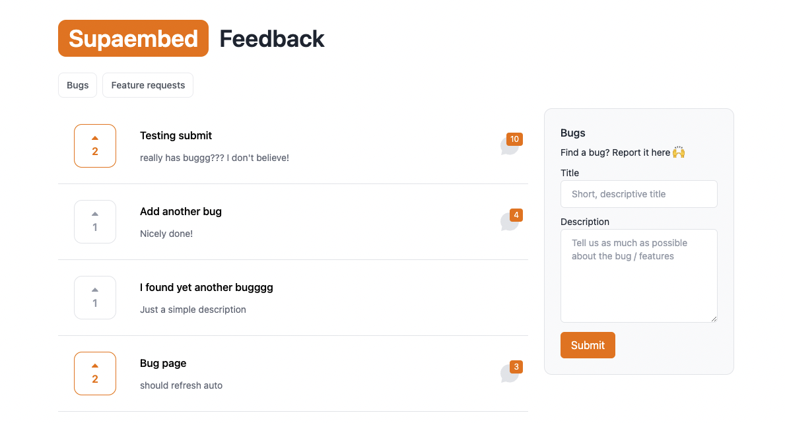

<!-- PROJECT LOGO -->
<br />
<p align="center">
  <a href="https://github.com/zernonia/supaembed">
    
  </a>

  <h3 align="center">Supaembed <strong>(Alpha)</strong></h3>

  <p align="center">
    Embed custom tools on your website with your <strong>Supabase</strong> instance.
    <br />
    Free • Open Source
    <br />
    <br />
    <a href="https://www.aurora.courses/feedback">View Demo</a>
    ·
    <a href="https://github.com/zernonia/supaembed/issues">Report Bug</a>
    ·
    <a href="https://github.com/zernonia/supaembed/issues">Request Feature</a>
  </p>
</p>



## 🚀 Features

- 🤩 Free & Open Source
- 🚀 Your own Supabase instance
- 🌟 Your user can interact without signing in (Respect RLS too)
- 🎨 Alowed to use on your own project
- 🌌 No stealing your data, so don't worry 😂

## 📇 About The Project

I wanted to have a **bug/feature request/roadmap tools** in my [latest project, Aurora](https://www.aurora.courses), but I don't want users to sign in another tool just to do that.

Then I discovered the amazing Embedding features by [Dashibase](https://github.com/Dashibase/dashibase-insert), which allow user to embed form and still respect the RLS. I reached out to [SK](https://github.com/greentfrapp) (Thank you! 🙌🏼) to learn the mechanism.


After that, I expose the NEW schema (so that it won't clogged up public schema), and utilized Supabase powerful Postgrest endpoint, as well as the embedding faeture above to build this tool.

Enjoy! 😁

### 🔨 Built With

- [Vue 3](https://vuejs.org/)
- [Vite](https://vitejs.dev/)
- [WindiCSS](https://windicss.org/)
- [Supabase](https://supabase.com/)

## Steps

WIP 😅

## 🌎 Local Development

### Prerequisites

Yarn

- ```sh
  npm install --global yarn
  ```

### Development

1. Clone the repo
   ```sh
   git clone https://github.com/zernonia/supaembed.git
   ```
2. Install NPM packages
   ```sh
   cd supaembed
   yarn install
   ```
3. Run local Vercel development instance
   ```sh
   yarn dev
   ```

## ➕ Contributing

Contributions are what make the open source community such an amazing place to be learn, inspire, and create. Any contributions you make are **greatly appreciated**.

1. Fork the Project
2. Create your Feature Branch (`git checkout -b feature/AmazingFeature`)
3. Commit your Changes (`git commit -m 'Add some AmazingFeature'`)
4. Push to the Branch (`git push origin feature/AmazingFeature`)
5. Open a Pull Request

## 🧡 Acknowledgement

- Thank you [SK](https://github.com/greentfrapp) for discovering the possibilities of embedding tools that respect User's RLS and share it with me! Check out [Dashibase](https://dashibase.com/)!

- Thank you [Austin Malerba](https://github.com/malerba118) for [Supabase Comment Extension](https://github.com/malerba118/supabase-comments-extension) that scaffold the comment for this project. Check out [Scrollex](https://scrollex-docs.vercel.app/)

## 📜 License

Not Associated with Supabase.

Distributed under the MIT License. See `LICENSE` for more information.

# 📧 Contact

Zernonia - [@zernonia](https://twitter.com/zernonia) - zernonia@gmail.com

Also, if you like my work, please buy me a coffee ☕😳

<a href="https://www.buymeacoffee.com/zernonia" target="_blank">
    
  </a>
